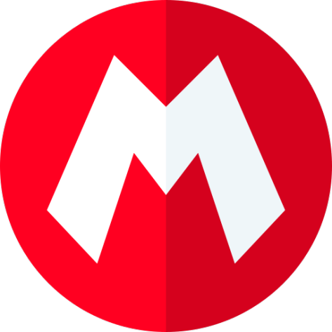

# 🍄 Super Mario Bros - O Filme

<p align="center">
  
</p>

<p align="center">
  
  
  
</p>

## 📌 Sobre o Projeto
Landing page temática desenvolvida para o lançamento de **Super Mario Bros. O Filme**. Em aulas de estudo DEV_EMDOBRO.

---

## 🚀 Funcionalidades
- [x] **Vídeo de Fundo:** Fundo dinâmico com loop otimizado.
- [x] **Modal Interativo:** Sistema de pop-up para o trailer sem recarregar a página.
- [x] **Gestão de Áudio:** O vídeo do YouTube encerra automaticamente ao fechar o modal.
- [x] **Design Responsivo:** Layout preferêncialmente adaptado para Desktop, Tablet e Mobile.

---

## 🛠️ Tecnologias Utilizadas
O projeto foi construído "raiz" (Vanilla), sem frameworks, para demonstrar domínio em:

*   **HTML5:** Estruturação semântica.
*   **CSS3:** Flexbox, Variáveis CSS, Media Queries e Efeitos de Transição.
*   **JavaScript:** Manipulação de DOM, Event Listeners e controle de atributos de Iframe.

---

## 📱 Visualização (Mobile & Desktop)

> [!TIP]
> No mobile, os elementos devem se reordenam automaticamente: o texto assume o topo e a imagem do Mario se ajusta à base para melhor legibilidade.


---

## ⚙️ Como executar
1. Clone este repositório:
   ```bash
   git clone https://github.com
   ```
2. Navegue até a pasta do projeto.
3. Abra o arquivo `index.html` em seu navegador de preferência.
   *Recomendação: Use a extensão **Live Server** no VS Code.*

---

## ✍️ Autor
Desenvolvido por **Seu Nome**.
<br>
[](https://linkedin.com)
[](https://github.com)

---
<p align="center">Feito com ❤️ por um fã da Nintendo</p>
